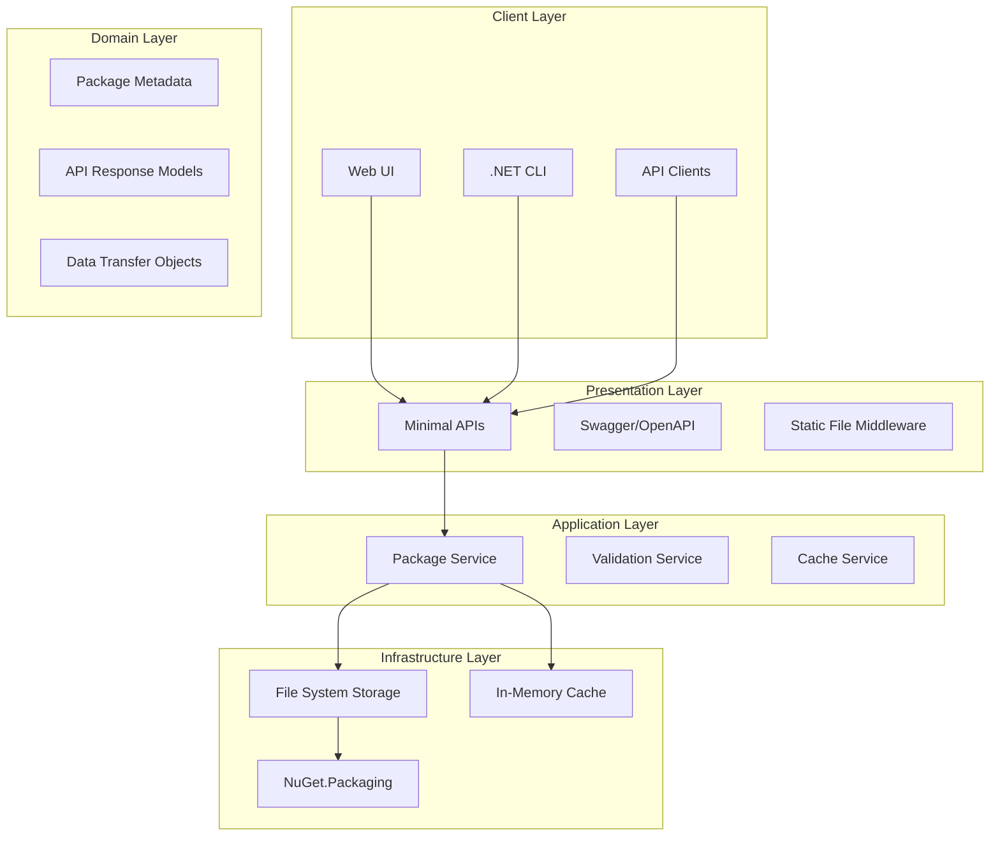
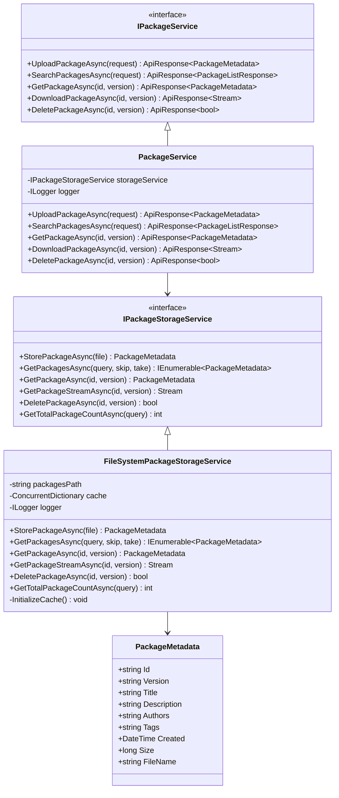
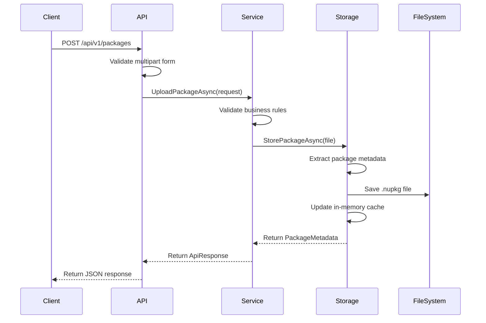
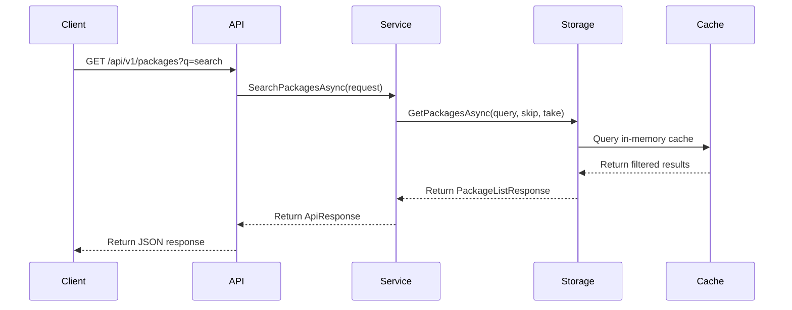
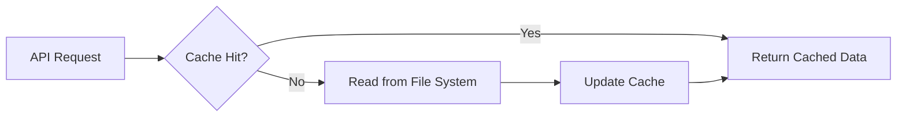
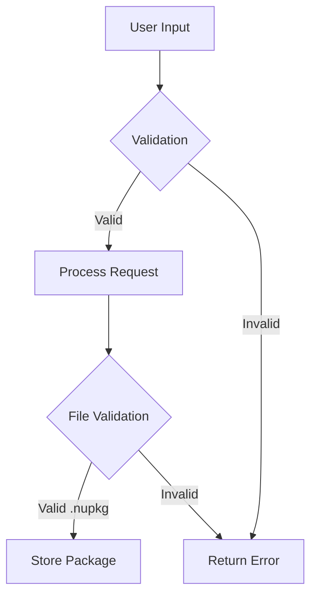
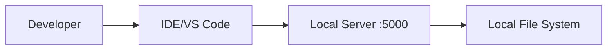
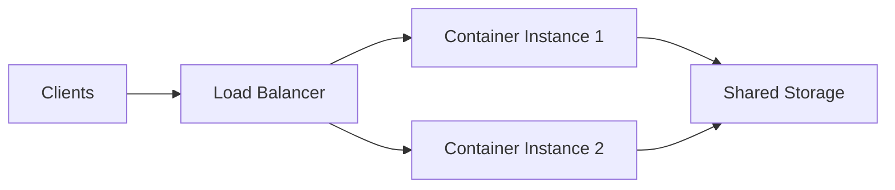

# Architecture Documentation

## Overview

Nupack Server is built using a clean, layered architecture that promotes maintainability, testability, and scalability. The system follows Domain-Driven Design principles and implements the Repository pattern for data access.

## System Architecture

## Layer Responsibilities

### 1. Presentation Layer

**Location**: `src/Nupack.Server.Api/Program.cs`

**Responsibilities**:
- HTTP request/response handling
- API endpoint routing
- Input validation
- Response formatting
- Authentication/Authorization (future)

**Components**:
- **Minimal APIs**: High-performance HTTP endpoints
- **Swagger/OpenAPI**: Interactive documentation
- **Static File Middleware**: Serves web UI and package files
- **CORS Middleware**: Cross-origin request handling

### 2. Application Layer

**Location**: `src/Nupack.Server.Api/Services/`

**Responsibilities**:
- Business logic orchestration
- Service coordination
- Transaction management
- Error handling and logging

**Components**:
- **IPackageService**: Core business logic interface
- **PackageService**: Business logic implementation
- **Validation Logic**: Input and business rule validation
- **Caching Strategy**: Performance optimization

### 3. Domain Layer

**Location**: `src/Nupack.Server.Api/Models/`

**Responsibilities**:
- Domain entities and value objects
- Business rules and invariants
- Domain events (future)

**Components**:
- **PackageMetadata**: Core domain entity
- **ApiResponse<T>**: Standardized response wrapper
- **Request/Response DTOs**: Data transfer contracts

### 4. Infrastructure Layer

**Location**: `src/Nupack.Server.Api/Services/`

**Responsibilities**:
- External system integration
- Data persistence
- File system operations
- Third-party library integration

**Components**:
- **IPackageStorageService**: Storage abstraction
- **FileSystemPackageStorageService**: File system implementation
- **NuGet.Packaging Integration**: Package processing
- **In-Memory Caching**: Performance optimization

## Component Diagram

## Data Flow

### Package Upload Flow

### Package Search Flow

## Design Patterns

### 1. Repository Pattern
- **Interface**: `IPackageStorageService`
- **Implementation**: `FileSystemPackageStorageService`
- **Benefits**: Abstraction over data access, testability, flexibility

### 2. Service Layer Pattern
- **Interface**: `IPackageService`
- **Implementation**: `PackageService`
- **Benefits**: Business logic encapsulation, transaction management

### 3. Dependency Injection
- **Container**: Built-in .NET DI container
- **Lifetime**: Scoped services for request-based operations
- **Benefits**: Loose coupling, testability, configuration flexibility

### 4. Response Wrapper Pattern
- **Type**: `ApiResponse<T>`
- **Benefits**: Consistent API responses, error handling standardization

## Performance Considerations

### Caching Strategy

**Cache Implementation**:
- **Type**: `ConcurrentDictionary<string, PackageMetadata>`
- **Key**: `{packageId}:{version}`
- **Invalidation**: On package upload/delete
- **Benefits**: Sub-millisecond metadata access

### File I/O Optimization

- **Streaming**: Direct file streaming for downloads
- **Async Operations**: Non-blocking I/O operations
- **Memory Management**: Proper disposal of streams and resources

## Security Architecture

### Input Validation

**Validation Layers**:
1. **HTTP Level**: Content-Type, file size limits
2. **Application Level**: Business rule validation
3. **File Level**: NuGet package format validation

### Error Handling

- **Structured Logging**: Comprehensive error tracking
- **Safe Error Messages**: No sensitive information exposure
- **Exception Handling**: Graceful degradation

## Scalability Considerations

### Current Limitations

- **Single Instance**: No horizontal scaling support
- **File System Storage**: Limited by disk I/O
- **In-Memory Cache**: Lost on restart

### Future Enhancements

- **Database Storage**: SQL Server, PostgreSQL support
- **Distributed Cache**: Redis integration
- **Load Balancing**: Multiple instance support
- **Cloud Storage**: Azure Blob, AWS S3 integration

## Technology Stack

### Core Technologies

- **.NET 8**: Latest LTS runtime
- **ASP.NET Core**: Web framework
- **Minimal APIs**: High-performance endpoints
- **NuGet.Packaging**: Package processing library

### Development Tools

- **Swagger/OpenAPI**: API documentation
- **Docker**: Containerization
- **xUnit**: Testing framework (future)
- **Serilog**: Structured logging (future)

## Deployment Architecture

### Development Environment

### Production Environment

## Monitoring and Observability

### Logging Strategy

- **Structured Logging**: JSON format for log aggregation
- **Log Levels**: Appropriate use of Debug, Info, Warning, Error
- **Correlation IDs**: Request tracing across components

### Metrics Collection

- **Performance Metrics**: Response times, throughput
- **Business Metrics**: Package uploads, downloads, searches
- **System Metrics**: Memory usage, disk space, CPU utilization

### Health Checks

- **Endpoint**: `/health` (future enhancement)
- **Dependencies**: File system access, memory usage
- **Integration**: Kubernetes readiness/liveness probes

## Testing Strategy

### Unit Testing

- **Service Layer**: Business logic validation
- **Storage Layer**: Data access operations
- **Model Validation**: DTO and entity testing

### Integration Testing

- **API Endpoints**: End-to-end request/response testing
- **File Operations**: Package upload/download workflows
- **Error Scenarios**: Exception handling validation

### Performance Testing

- **Load Testing**: Concurrent user simulation
- **Stress Testing**: Resource limit validation
- **Benchmark Testing**: Performance regression detection

---

This architecture provides a solid foundation for a production-ready NuGet server while maintaining flexibility for future enhancements and scaling requirements.
